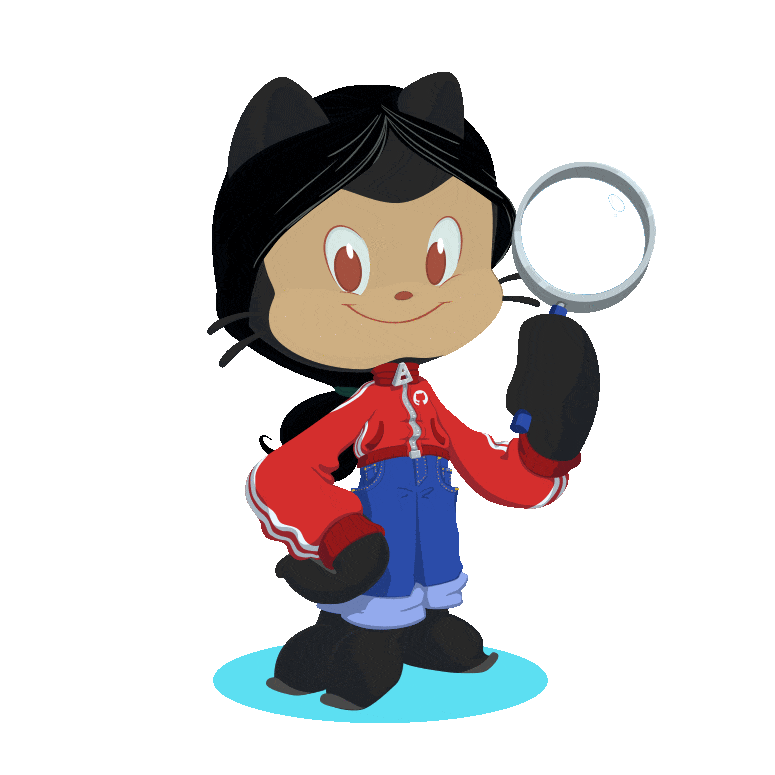

  <!--  -->

  

<!-- 

<p align="center"> 
   Visitor count:

   
 

 -->

#  About Me:

👋 Hello, I'm Hadi Haider🤍, an enthusiastic Web and app Developer eager to contribute to team success through hard work, attention to detail, and excellent organizational skills. Motivated to learn, grow, and excel in the Tech industry.
  Currently serving as a JAM and MERN stack position at Expedey situated in Karachi. Strong arts, design professional, and engineering professional. Studying Bachelor's degree focused in Computer Science from <a href="https://www.uitu.edu.pk/">Usman Institute of Technology</a>. I'm passionate about staying ahead of the curve when it comes to the latest technologies and contributing to open-source. Currently, I am Dev Lead and a proud core team member of <a href="https://gdscuit.web.app/">DSCUIT</a>

**Talking about Personal Stuffs:**

- 👨🏽‍🌱 I’m currently working on enhancing my backend skills
- 🔭 I’m currently learning Rust, which is my new love
- 💬 Ask me about Javascript, Typescript, React, Next, AWS Serverless orchestration, Rust, GitHub, and anything related to programming

---

##  Socials:

 
 

##  Tech Stack:

| Stats                                                                                    | Streak                                                                                                                                                                                                            | Languages                                                                                             |
| --------------------------------------------------------------------------------------------------------------------------------------------- | ---------------------------------------------------------------------------------------------------------------------------------------------------------------------------------------------------------------------------------------------------------------------- | ---------------------------------------------------------------------------------------------------------------------------------------------------------- |
|  |  |  |

---

## 🏆 GitHub Trophies

---

 <blockquote class="badgr-badge" style="font-family: Helvetica, Roboto, &quot;Segoe UI&quot;, Calibri, sans-serif;">
Postman API Fundamentals Student Expert

<strong style="font-size: 12px; font-weight: bold; font-style: normal; font-stretch: normal; line-height: 1.67; letter-spacing: normal; text-align: left; color: #000;">Awarded: </strong>May 29, 2023

<a class="badgr-badge-verify" target="_blank" href="https://badgecheck.io?url=https%3A%2F%2Fapi.badgr.io%2Fpublic%2Fassertions%2FhAVCE9b7TM-ZncdHK4Ci3g%3Fidentity__email%3Dhaiderhadi055gmail.com&amp;identity__email=haiderhadi055@gmail.com" style="box-sizing: content-box; display: flex; align-items: center; justify-content: center; margin: 0; font-size:14px; font-weight: bold; width: 48px; height: 16px; border-radius: 4px; border: solid 1px black; text-decoration: none; padding: 6px 16px; margin: 16px 0; color: black;">VERIFY</a>
</blockquote>
 
 
<!--  -->
