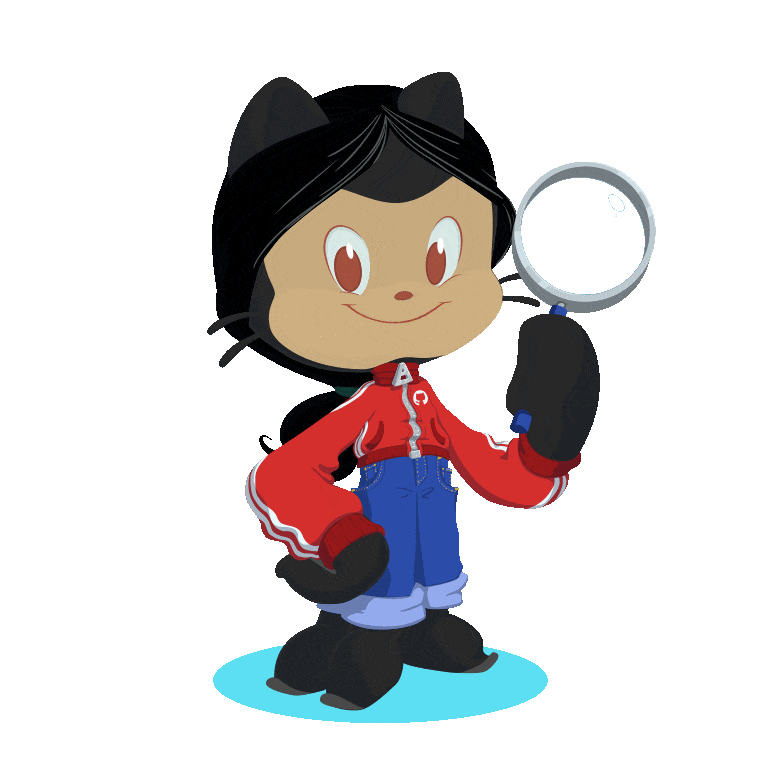

  

##  About Me:

👋 Hello, I'm Hadi Haider🤍, an enthusiastic Full Stack Web and App Developer eager to contribute to team success through hard work, attention to detail, and excellent organizational skills. Motivated to learn, grow, and excel in the Tech industry. Strong arts, design professional, and engineering professional. I graduated with a Bachelor's degree in Computer Science from <a href="https://www.uitu.edu.pk/">Usman Institute of Technology</a>. I'm passionate about staying ahead of the curve when it comes to the latest technologies and contributing to open-source. I served as Dev Lead and Lead at <a href="https://gdscuit.web.app/">GDGOC UIT</a> (formerly DSCUIT) and currently serving as a mentor.

**Talking about Personal Stuffs:**

-   👨🏽‍🌱 Tech Geek, always ready to learn new Technologies/Frameworks/Languages
-   🔭 I’m currently learning Rust, which is my new love
-   💬 Ask me about JavaScript, TypeScript, React, Next.js, AWS Serverless orchestration, Rust, Docker, and anything related to programming
-   🥅 2026 Goals: Contribute more to Open-Source projects and build scalable systems

---

##  Socials:

 
 

##  Tech Stack:

